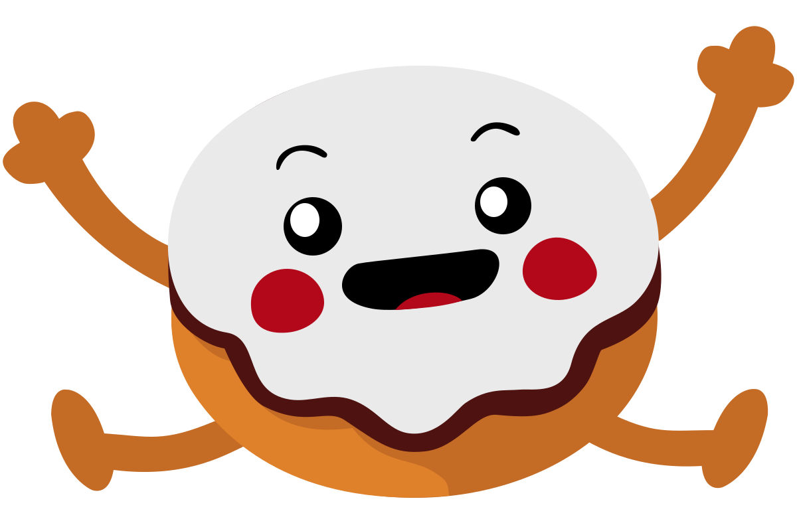

# ponczek
*Deep-fried game framework with sweet filling.*

## Why?
I wanted something that would make it easier for me to create 2D games during game jams. This framework's design and future development reflects the type of games I like to make.

I've made this for myself, but anyone is welcome to use it. Expect breaking changes though.

## What it is?
- Very opinionated
- Software rendering
- Easy to use with *fantasy console*-like API
- Prioritizes performance over memory usage and bundle size
- Tries really hard to avoid GC in game loop
- Provides API that makes it easy to avoid GC in game loop
- (almost) zero dependencies
- Easy to understand and extend code base

## What it is not?
- Not made for high fidelity games
- Not a fully featured game engine
- Does not support mobile

## Features
- 2D software rendering
  - Primitive shape rendering (rectangles, circles)
  - Drawing textures
  - Drawing nine slices
  - Drawing monospaced sprite fonts
  - Clipping
  - *Fragment shader*-like effect system
  - Camera
- Simple sound effects player
- Keyboard and mouse input system
  - Supports binding
- Math module
  - Data structures and algorithms (Vector2, Rectangle)
  - Random number generator
- GUI
  - Grid component with keyboard navigation
- Asset loader
- Stack based scene manager
- Data storage for save data (uses `localStorage`)
- Timers

Uses fantastic font [Monogram by datagoblin](https://datagoblin.itch.io/monogram) as default font.

## License
This project is licensed under the [MIT license](LICENSE).
